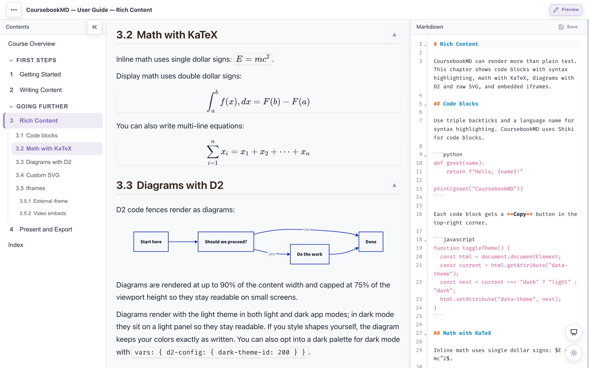

#  CoursebookMD

A document-first authoring and presentation tool for course material written in Markdown.

Write connected Markdown chapters, present them with scroll-and-spotlight navigation, and publish the same content as a static HTML site for students.



## Why

Slide-based tools (PowerPoint, Keynote) force content into discrete pages, breaking the narrative thread between concepts. Students get slides they cannot read linearly. Instructors get layout work instead of content work.

CoursebookMD treats the chapter as the unit of content. You write a connected Markdown document — the same thing you would hand to a student as a reading. When you lecture, you present it with spotlight navigation that dims surrounding sections. When you publish, the same Markdown becomes a browsable HTML site.

- **Markdown rendering** — markdown-it with tables, strikethrough, and task lists
- **Syntax highlighting** — Shiki (VS Code TextMate grammars, inline styles, no theme CSS needed)
- **Math** — KaTeX for inline (`$...$`) and display (`$$...$$`) equations
- **Diagrams** — D2 for flowcharts, sequence diagrams, etc., plus raw SVG for custom visuals
- **Adaptive diagram sizing** — diagrams render at their natural size (never stretched to the column) and scale down proportionally when taller than 75% of the viewport; click one to read it full-size. A fence's `height=` option overrides the cap per diagram: `height=300` (pixels), any CSS length such as `height=80vh`, or `height=none` for full natural height in the page flow
- **Tap to expand media** — click or tap any image or diagram to open it full-size over a dimmed backdrop (`Esc` or a click closes it). On phones this is how a wide diagram, or an image a table crops to a shared height, becomes readable
- **CodeMirror editor** — syntax-highlighted Markdown editing with live preview sync, find/replace, folding, and undo/redo that survives chapter switches and walks across previously edited chapters when one chapter's history runs out
- **Live preview on save** — when a coursebook is opened from disk (Chrome/Edge), files edited and saved in an external editor are detected automatically: by default a prompt offers to reload (plus an "Always auto-reload" shortcut that turns the setting on), and with "Auto-reload files changed on disk" enabled in Settings the preview re-renders just the changed section without asking; unsaved in-app edits always win, and structural `coursebook.md` changes reload the coursebook (when auto-reload is enabled)
- **Reload Coursebook** — File → Reload Coursebook re-reads the coursebook from disk without re-opening it: fresh files for everything you have not edited, while unsaved in-app edits are kept (in every mode that can re-read: disk folders and URL-loaded coursebooks). Firefox/Safari cannot see file changes after a folder is opened (the browser only provides selection-time copies), so there the action explains the limitation and a re-open picks up the latest files
- **Indexed terms** — mark terms with `==double equals==` for a dotted underline; every occurrence is collected into a generated index with per-section links, hover tooltips ("Also in: …"), and a highlight flash when you navigate from the index
- **Link previews** — hover a link to see a summary popup. Links into the same workbook (chapters, sections) preview instantly, read from the loaded content with no network. External links fetch summaries: Wikipedia links use the Wikipedia summary API; other links go through r.jina.ai, and pages that fail or demand sign-in show no popup.
- **Link validation** — broken chapter links, missing images, and dead `#hash` targets are reported when a coursebook loads and before you save
- **Source jump** — in edit mode, clicking a heading or paragraph in the preview scrolls the editor to that line (highlighted with an accent tint)
- **Code-block Tab** — Tab/Shift+Tab indent and dedent inside fenced code blocks; Tab in prose keeps its browser focus role
- **Presentation mode** — a separate presentation window with scroll-and-spotlight navigation, a "Section 3 of 12" progress overlay, a `?` shortcuts sheet, and a `B` black-out screen; it auto-places on a second display or projector (Chrome/Edge) and auto-fullscreens there, while the main window stays interactive for editing and notes
- **Table of contents** — auto-generated from headings with hierarchical section numbering
- **Per-heading go-up links** — a `▲` button beside every H2 returns to the chapter top
- **Themes** — light/dark mode with three palettes (Warm Graphite, Cool Indigo, Blue Slate)
- **Settings modal** — theme and palette selection
- **Copy to clipboard** — one-click copy on every code block
- **Runnable code blocks** — fenced `python` and `javascript` blocks marked with `run` in the fence info string get a Run button beside Copy: the code executes in the browser (Python via Pyodide/WebAssembly, preloaded in the background from the CDN, ~10 MB) with stdout/stderr streaming into an output panel and a Stop button for runaway loops. Opt-in by design: blocks that need `input()`, files, packages, or the page itself stay non-runnable. REPL transcripts (`>>>` prompts) are stripped before running. Works in the app and in the static HTML export
- **Collapsible chapter groups** — group labels in the sidebar expand/collapse their chapters; state persists across sessions
- **Static export** — `npm run build` produces a standalone HTML site: a header with the coursebook title, a chapter/TOC sidebar (an overlay drawer on phones), presentation mode on desktop, dual-theme code highlighting, reading aids, index, and link tooltips — readable even with JavaScript disabled, and navigable with a screen reader

## Quick Start

```bash
npm install
npm run dev
```

Open `http://127.0.0.1:8200` in your browser.

## Project Structure

A coursebook is a folder with a parent Markdown file and a `chapters/` directory:

```
my-coursebook/
├── coursebook.md            # parent: course title, intro, chapter list
├── chapters/
│   ├── 01-introduction.md
│   ├── 02-variables.md
│   └── ...
└── assets/                  # images, diagrams
```

The parent `coursebook.md` is a normal Markdown file. The chapter list is a plain bullet list of links:

```markdown
# My Coursebook

Welcome to the course...

## Chapters

- [Getting Started](chapters/01-getting-started.md)
- [Writing Content](chapters/02-writing-content.md)
- [Rich Content](chapters/03-rich-content.md)
- [Present and Export](chapters/04-present-and-export.md)
```

No manifest, no JSON, no config. The link order defines the chapter order.

### Grouping chapters

An H2 or H3 heading immediately before chapter links becomes a collapsible group label in the sidebar. This lets you organize chapters into weeks, modules, or any grouping you like:

```markdown
# My Coursebook

## Chapters

### Week 1

- [Introduction](chapters/01-introduction.md)
- [Variables](chapters/02-variables.md)

### Week 2

- [Conditionals](chapters/03-conditionals.md)
- [Loops](chapters/04-loops.md)
```

Each group label is clickable — readers can collapse or expand its chapters. Collapsed state persists across sessions.

### Sample coursebook

This repo includes a sample coursebook in `docs/`:

```
docs/
├── coursebook.md            # parent file (CoursebookMD User Guide)
└── chapters/
    ├── 01-getting-started.md
    ├── 02-writing-content.md
    ├── 03-rich-content.md
    └── 04-present-and-export.md
```

The app loads `docs/coursebook.md` by default on startup.

## Development

```bash
npm run dev          # start dev server
npm run build        # build static HTML to dist/
npm run preview      # preview the build locally
npm run export:html  # export a coursebook to standalone HTML from the CLI
npm run lint            # run eslint
npm run format:check    # check formatting
npm run format:write    # fix formatting
npm run test:e2e:install # install Playwright Chromium browser
npm run test:e2e       # run Playwright end-to-end tests
npm run test:e2e:fast  # run the core-flow browser tests while iterating
```

## Link previews

CoursebookMD fetches previews for external links as soon as a coursebook loads and caches them in memory. Wikipedia links use the Wikipedia REST API; other links use the [Jina AI Reader](https://jina.ai/reader). The popup renders the summary as formatted Markdown, and sign-in or blocked pages are detected and do not produce a popup.

Links into the same workbook — chapter links rewritten to `#chapter-slug` and raw `#heading` anchors — use no network at all: hovering one shows the target section's title and opening content, read straight from the rendered page. The popup's title follows the link in place instead of opening a new tab, and the preview works the same way in the exported HTML viewer.

To pre-build a `previews.json` cache for faster loads and fewer API calls:

```bash
# Set JINA_API_KEY in .env for generic links (optional but recommended)
node --env-file=.env tools/build-previews.mjs docs/coursebook.md

# Or for a single chapter
node --env-file=.env tools/extract-previews.mjs chapters/01-introduction.md
```

The app will load `previews.json` from the coursebook directory automatically.

## Indexed terms

Mark a term with `==double equals==` to give it a dotted underline and collect it into an index that is built automatically:

```markdown
A ==variable== is a named location in memory.
```

Every occurrence of a term lands in one index entry. Each locator links to the occurrence and is labeled by its section number, hovering an occurrence shows a tooltip with the term's other locations ("Also in: …"), and following an index link flashes the term so it is easy to spot. The index ships in the app, in the HTML export, and in PDF exports — a PDF that covers only part of the book gets a filtered copy containing just its own chapters (`--no-index` skips it).

A term can carry aliases — extra names under which the same occurrence is listed. Text after a `|` inside the marks does not render:

```markdown
A ==for loop|loop== repeats a block of code.
```

The sentence shows "for loop", and the index gains both a "for loop" and a "loop" entry pointing at the same spot — useful when students might look a concept up under either name. Several aliases can be given (`==term|a|b==`). The alias syntax is unavailable inside table cells, where `|` ends the cell.

Marking guidelines, borrowed from professional book indexing:

- Mark the handful of terms a student would actually search for — a few key concepts per section, not every mention of a common word. An index is more than a concordance: passing mentions do not earn a locator.
- Prefer concrete noun phrases ("call stack", not "stack").
- Alias the other names a student might try (`==for loop|loop==`) instead of marking every synonym separately.
- Keep spelling consistent. Grouping and sorting are case-insensitive, and the first-seen casing is what the index displays.
- Terms are inline only and are never parsed inside code spans, so code identifiers stay out of the index naturally.

## Export to HTML from the CLI

Export HTML in the app produces a standalone HTML file you can share or upload (for example, to Teams). To generate the same file from the terminal:

```bash
node tools/export-html.mjs path/to/coursebook.md # writes the export to the current directory
node tools/export-html.mjs path/to/coursebook.md -o out.html
```

The script boots the dev server, opens the coursebook in headless Chromium, and saves the file produced by the app's own export action, so the output matches an in-browser export. Any `.md` file works — it does not have to be named `coursebook.md`.

## Export to PDF from the CLI

The standalone HTML export can also be printed to one or more PDFs with headless Chromium:

```bash
npm run export:pdf -- path/to/coursebook.md # whole book → output/pdf/<name>.pdf
npm run export:pdf -- path/to/coursebook.md --split chapters # one PDF per chapter
npm run export:pdf -- path/to/coursebook.md --chapters 1-8 -o week1.pdf
npm run export:pdf -- path/to/coursebook.md --presets weeks.json
```

`--out-dir` picks the output directory (default `output/pdf`), `--format a4` switches paper size from the default Letter, and `--keep-html` also saves the intermediate standalone HTML. By default each PDF gets a running header (course title on the left, the current chapter on every non-opening page) and a footer with page numbers, and opens at 80% zoom in viewers that honor the document's open action; `--no-header` skips the stamping pass. Chapter titles print in textbook style, with the number pulled out into a "Chapter N" kicker above the title. Chapter selection accepts chapter numbers, ranges (`1-8`), or section slugs, with `overview`/`index` excluded from chapter numbering.

Week- or part-style groupings cannot be detected from the coursebook itself, so named multi-PDF runs use a presets file:

```json
{
  "institution": "Example University",
  "campus": "Main Campus",
  "term": "Fall 2026",
  "outputs": [
    { "name": "Course-Notes" },
    { "name": "Course-Week-1-Chapters-1-8", "chapters": "1-8", "label": "Week 1" },
    { "name": "Course-Week-2-Chapters-9-10", "chapters": "9-10", "label": "Week 2" }
  ]
}
```

Each output can also carry a `"label"`, and `--label`, `--term`, `--institution`, and `--campus` (or the file's `"term"`/`"institution"`/`"campus"`) add a cover-style intro to page 1: the course title as the headline, the week label beneath it, and the institution, campus, and term as a small meta line, all centered on a taller first page.

PDFs that don't include the coursebook's index section automatically get one appended, filtered to the chapters they contain, so the dotted-underline indexed terms always have a lookup. Use `--no-index` to skip that.

Each PDF is tagged (accessible text), includes a bookmark outline built from the headings, and is rendered in the light theme regardless of the exporting machine's settings. Requires Chromium for Playwright (`npm run test:e2e:install`).

## Tech Stack

| Layer               | Tool        |
| ------------------- | ----------- |
| Build               | Vite        |
| Markdown            | markdown-it |
| Syntax highlighting | Shiki       |
| Math                | KaTeX       |
| Diagrams            | D2 + SVG    |
| Icons               | Lucide      |

## Notes

- The D2 diagram runtime is lazy-loaded, so it is only downloaded when a page contains a `d2` code fence. The runtime chunk is large (~8 MB after minification) because it bundles the D2 compiler and layout engine entirely on the client.
- Exported HTML files do not re-render D2 or raw SVG diagrams when the user toggles the theme in the exported file. Diagrams render light in both modes on a light panel (or use the D2 source's own `dark-theme-id`); everything else, including code highlighting, follows the viewer's theme choice.

## License

MIT
